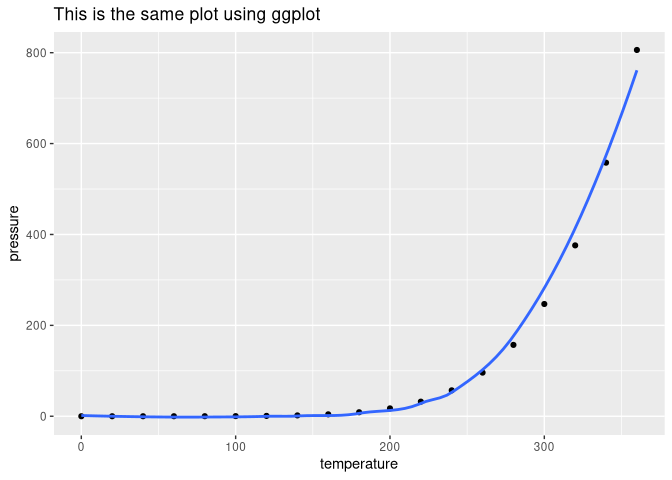
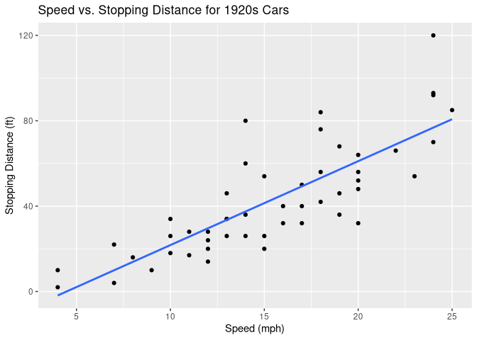

SDS 192: Problem Set 7
================

#### GitHub Documents

This is an R Markdown format used for publishing markdown documents to
GitHub. When you click the **Knit** button all R code chunks are run and
a markdown file (.md) suitable for publishing to GitHub is generated.

## Here is some Code

You can include R code in the document as follows:

``` r
glimpse(cars)
```

    ## Rows: 50
    ## Columns: 2
    ## $ speed <dbl> 4, 4, 7, 7, 8, 9, 10, 10, 10, 11, 11, 12, 12, 12, 12, 13, 13, 13…
    ## $ dist  <dbl> 2, 10, 4, 22, 16, 10, 18, 26, 34, 17, 28, 14, 20, 24, 28, 26, 34…

``` r
summary(cars)
```

    ##      speed           dist       
    ##  Min.   : 4.0   Min.   :  2.00  
    ##  1st Qu.:12.0   1st Qu.: 26.00  
    ##  Median :15.0   Median : 36.00  
    ##  Mean   :15.4   Mean   : 42.98  
    ##  3rd Qu.:19.0   3rd Qu.: 56.00  
    ##  Max.   :25.0   Max.   :120.00

------------------------------------------------------------------------

## Visualizations Go Here

You can also embed plots.

**For example:**

    ## `geom_smooth()` using method = 'loess' and formula 'y ~ x'

<!-- -->

<!-- -->

Note that the `echo = FALSE` parameter was added to the code chunk to
prevent printing of the R code that generated the plot.
